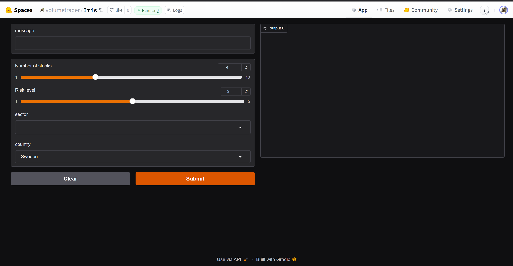
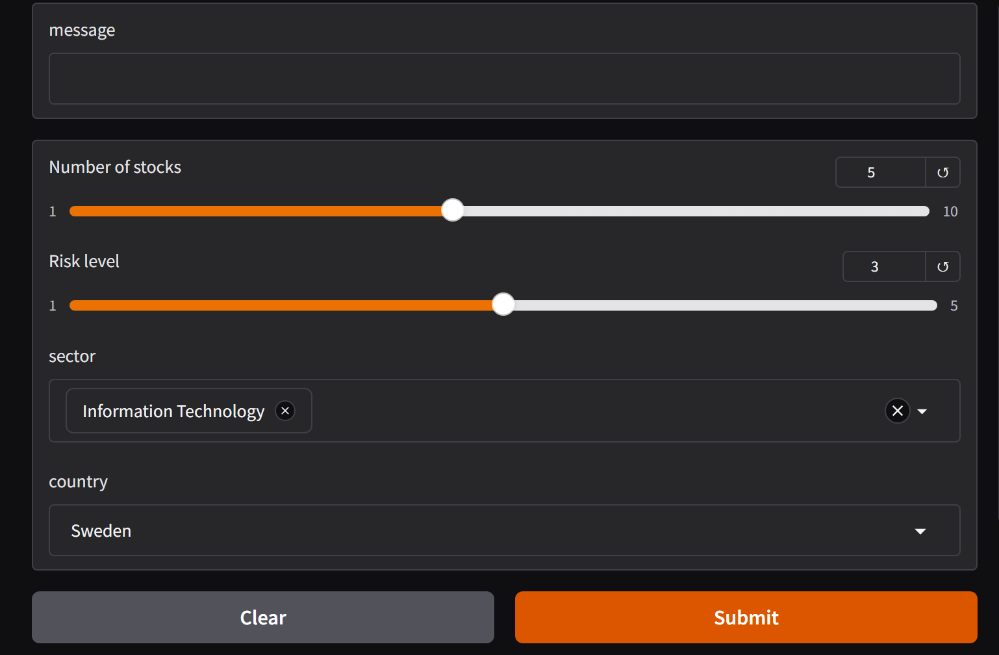

This project was created as part of a course on Scalable ML ID2223 @ KTH

Purpose 
---
The purpose of this project was to fine-tune a LLM and build and inference pipeline and interface. 
We built a interface for the tasks of choosing stocks for your portfolio. You can with our tool input your risk tolerance,
markets and sectors you're interested in and our model will help suggest
personalized investment opportunities.

The base models we used for fine-tuning:
--- 
Base models were retrieved from huggingface.co

"unsloth/Llama-3.2-1B-Instruct-bnb-4bit"

"unsloth/Llama-3.2-1B-Instruct"

"unsloth/Phi-3.5-mini-instruct"

Datasets
---
Datasets were retrieved from huggingface.co

"mlabonne/FineTome-100k"

"gbharti/finance-alpaca"

Interface
---
The interface was designed to allow the user get stock recommendations
with other ways of interaction that purely chatting.

Improvement - model centric approach:
---
To improve on the performance of the model a full fine-tuning of the model could have been done instead of the lora model which is more efficient to train and requires less ram but does not have as high performance as a full fine-tuning.

Improvement - data centric approach:
---
To improve on the initial model (Version1) a dataset which is more suited for our objective as a financial adivisor could boost the models performance
by receiving more domain-specific knowledge during the fine-tuning.
We found a dataset to that end with: https://huggingface.co/datasets/gbharti/finance-alpaca which we have used to train the second iteration of
our financial advisor.

Model iteration 2 - results
---

In the second iteration we used as mentioned above a finance dataset
and another base model: "unsloth/Phi-3.5-mini-instruct" which is a model with more parameters. Our hypothesis
was that these two changes would increase the performance and helpfulness of the model.

<h3>First impressions</h3>
It was quickly realized that this model was requiring a lot more computional power
and had issues running inference on huggingface's free CPU. In contrast the 
previous model had been usable under the same circumstances.

<h3> Test example</h3>
---

This was the input parameters for our example (see img above): 5 swedish stocks in the information tech sector with a 3/5 risk level. No additional comments.

The result were as follows:

**Version 1 (unsloth/Llama-3.2-1B-Instruct-bnb-4bit, mlabonne/FineTome-100k)**
>Yes, here are 5 stocks from Sweden in the Information Technology sector: 
>1. Ericsson (SE:ISOF) - A leading provider of telecommunications equipment and services. 
>2. Spotify (SE:SPOT) - A music streaming service provider. 
>3. Spotify's parent company, Intercom (SE:ICOM) - A leading provider of customer relationship management (CRM) software. 
>4. Spotify's parent company, Spotify for Business (SE:SBFB) - A leading provider of music streaming services for businesses. 
>5. Spotify's parent company, Spotify for Developers (SE:SFDB) - A leading provider of tools and resources for developers. 
>
>These stocks are all listed on the Stockholm Stock Exchange (Bolsas y Mercados de Comercio de Suiza, BZX) and are considered to be stable and growth-oriented. They are also diversified across various industries and sectors, including telecommunications, music streaming, customer relationship management, music streaming services for businesses, and tools and resources for developers.

**Version 2 (unsloth/Phi-3.5-mini-instruct, gbharti/finance-alpaca)**
>Sure, here are 5 stocks from Sweden in the Information Technology sector:
>1. Ericsson 
>2. Nokia 
>3. Hexagon AB 
>4. ABB 
>5. AstraZeneca 
>
>These stocks are all listed on the Stockholm Stock Exchange and are considered to be relatively low risk investments.  I hope this helps!

In summary the second iteration of the model responds in more correct manner,
does less duplication and the output is more straight to the point.

We consider this as substantial performance increase, although it is more computational intensive to run and thus takes longer.